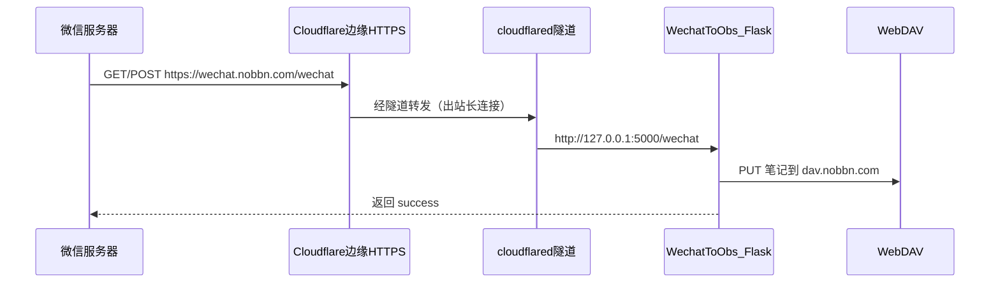

# Cloudflare Tunnel 详细配置指南（WechatToObs）

本文档面向 **nobbn.com + wechat.nobbn.com** 场景，将微信 Webhook 安全暴露到公网 HTTPS，**无需**：

- 路由器端口映射
- 服务器开放 80/443 入站
- Let's Encrypt / Certbot 证书

---

## 一、整体架构



| 组件 | 地址 | 说明 |
|------|------|------|
| 公网入口 | `https://wechat.nobbn.com/wechat` | 填到微信订阅号后台 |
| 健康检查 | `https://wechat.nobbn.com/health` | 部署后自检用 |
| 本机服务 | `http://127.0.0.1:5000` | Flask，不对外暴露 |
| Obsidian 同步 | `http://dav.nobbn.com/Obsidian` | 与 Tunnel 独立，走 WebDAV |

---

## 二、Cloudflare 控制台准备

### 2.1 域名接入 Cloudflare

1. 登录 [Cloudflare Dashboard](https://dash.cloudflare.com)
2. **Add a site** → 输入 `nobbn.com`
3. 选择 **Free** 计划即可
4. 按提示将域名注册商的 **Nameserver** 改为 Cloudflare 分配的两个 NS，例如：
   - `xxx.ns.cloudflare.com`
   - `yyy.ns.cloudflare.com`
5. 等待状态变为 **Active**（通常几分钟到 48 小时）

### 2.2 SSL/TLS 设置（重要）

路径：**SSL/TLS → Overview**

| 模式 | 是否推荐 | 说明 |
|------|----------|------|
| **Full** | 推荐 | Cloudflare 到源站也走加密；Tunnel 场景等效安全 |
| Flexible | 不推荐 | 仅用户到 CF 加密，Tunnel 不用此模式 |
| Full (strict) | 可选 | 需源站有有效证书；纯 Tunnel 到 HTTP 本地服务时用 **Full** 即可 |

路径：**SSL/TLS → Edge Certificates**

- 确认 **Always Use HTTPS** 可开启（浏览器访问自动跳 HTTPS）
- 微信 Webhook 只访问 HTTPS，此项对 API 无影响但建议开启

### 2.3 无需手动添加 A 记录

使用 `cloudflared tunnel route dns` 命令时，Cloudflare 会**自动**创建指向隧道的 CNAME 记录：

```
wechat.nobbn.com  →  <TUNNEL_ID>.cfargotunnel.com  （Proxied 橙云）
```

---

## 三、Linux 服务器安装 cloudflared

以下在运行 WechatToObs 的 Linux 机器上执行（Ubuntu / Debian 示例）。

### 3.1 安装

```bash
# 添加 Cloudflare 官方 apt 源
curl -fsSL https://pkg.cloudflare.com/cloudflare-main.gpg \
  | sudo tee /usr/share/keyrings/cloudflare-main.gpg >/dev/null

echo "deb [signed-by=/usr/share/keyrings/cloudflare-main.gpg] \
https://pkg.cloudflare.com/cloudflared $(lsb_release -cs) main" \
  | sudo tee /etc/apt/sources.list.d/cloudflared.list

sudo apt update
sudo apt install cloudflared -y

# 验证版本
cloudflared --version
```

### 3.2 其他系统

- **CentOS / RHEL**：见 https://developers.cloudflare.com/cloudflare-one/connections/connect-networks/downloads/
- **Windows 开发机**：`winget install Cloudflare.cloudflared` 或下载 exe

---

## 四、创建隧道（逐步命令）

### 4.1 登录 Cloudflare 账号

```bash
cloudflared tunnel login
```

- 终端会输出一个 URL，浏览器打开并选择站点 **nobbn.com**
- 授权成功后，本机生成 `~/.cloudflared/cert.pem`（账号级证书，**不是**隧道凭证）

### 4.2 创建隧道

```bash
cloudflared tunnel create wechat-obs
```

输出示例：

```
Created tunnel wechat-obs with id a1b2c3d4-e5f6-7890-abcd-ef1234567890
```

记下 **Tunnel ID** 和凭证文件路径：

```
~/.cloudflared/a1b2c3d4-e5f6-7890-abcd-ef1234567890.json
```

查看已有隧道：

```bash
cloudflared tunnel list
```

### 4.3 绑定 DNS 子域名

```bash
cloudflared tunnel route dns wechat-obs wechat.nobbn.com
```

成功后会显示类似：

```
Added CNAME wechat.nobbn.com which will route to this tunnel
```

在 Cloudflare **DNS → Records** 中应能看到 `wechat` 的 CNAME 记录，代理状态为 **Proxied（橙云）**。

### 4.4 部署配置文件

```bash
# 创建系统配置目录
sudo mkdir -p /etc/cloudflared

# 复制隧道凭证（将 <TUNNEL_ID> 替换为实际 ID）
sudo cp ~/.cloudflared/<TUNNEL_ID>.json /etc/cloudflared/
sudo chmod 600 /etc/cloudflared/<TUNNEL_ID>.json
```

创建 `/etc/cloudflared/config.yml`（与项目 [`cloudflared-config.yml`](cloudflared-config.yml) 一致）：

```yaml
# 隧道 ID（cloudflared tunnel list 查看）
tunnel: a1b2c3d4-e5f6-7890-abcd-ef1234567890

# 隧道凭证（仅该隧道可用，勿泄露、勿提交 git）
credentials-file: /etc/cloudflared/a1b2c3d4-e5f6-7890-abcd-ef1234567890.json

# 入站路由规则（从上到下匹配，最后一条必须是 catch-all）
ingress:
  # 所有 wechat.nobbn.com 的请求 → 本机 Flask
  - hostname: wechat.nobbn.com
    service: http://127.0.0.1:5000
  # 未匹配的请求返回 404（必填）
  - service: http_status:404
```

**ingress 规则说明：**

| 字段 | 含义 |
|------|------|
| `hostname` | 匹配的域名；省略则匹配所有 |
| `path` | 可选，如 `/wechat` 只转发该路径 |
| `service` | 后端地址，`http://` 或 `https://` |
| 最后一条 | 必须是 `http_status:404` 等 catch-all |

本方案将整个 `wechat.nobbn.com` 转发到 Flask，`/wechat` 与 `/health` 均由 Flask 处理，配置最简单。

### 4.5 校验配置

```bash
sudo cloudflared tunnel --config /etc/cloudflared/config.yml ingress validate
```

应输出：`Valid configuration file`

### 4.6 前台试运行（调试）

**先确保 WechatToObs 已启动**（见第六节），再：

```bash
sudo cloudflared tunnel --config /etc/cloudflared/config.yml run
```

另开终端测试：

```bash
curl -s https://wechat.nobbn.com/health
# 期望: {"service":"wechat-to-obs","status":"ok"}
```

确认无误后 `Ctrl+C` 停止前台进程，改用 systemd。

---

## 五、systemd 开机自启

### 5.1 安装服务单元

项目已提供 [`cloudflared.service`](cloudflared.service)：

```bash
sudo cp /opt/wechat-to-obs/deploy/cloudflared.service /etc/systemd/system/
sudo systemctl daemon-reload
sudo systemctl enable cloudflared
sudo systemctl start cloudflared
```

### 5.2 查看状态与日志

```bash
sudo systemctl status cloudflared
sudo journalctl -u cloudflared -f
```

正常日志应包含：

```
Connection registered
Registered tunnel connection
```

### 5.3 服务启动顺序

`cloudflared.service` 配置了 `After=wechat-obs.service`，建议：

1. 先启动 `wechat-obs`（Flask）
2. 再启动 `cloudflared`（隧道）

```bash
sudo systemctl start wechat-obs
sudo systemctl start cloudflared
```

---

## 六、WechatToObs 本机配置

### 6.1 config.yaml

```yaml
server:
  host: 127.0.0.1    # 仅本机访问，由 Tunnel 转发
  port: 5000
```

使用 Tunnel 时 **务必** 监听 `127.0.0.1`，避免 Flask 直接暴露到局域网/公网。

### 6.2 启动 WechatToObs

```bash
cd /opt/wechat-to-obs
source .venv/bin/activate
python app.py
```

或 systemd（[`wechat-obs.service`](wechat-obs.service)）：

```bash
sudo systemctl enable wechat-obs
sudo systemctl start wechat-obs
```

---

## 七、微信订阅号服务器配置

路径：**微信公众平台 → 设置与开发 → 基本配置 → 服务器配置**

| 配置项 | 填写内容 |
|--------|----------|
| URL | `https://wechat.nobbn.com/wechat` |
| Token | 与 `config.yaml` 里 `wechat.token` **完全一致**（自定义字符串，如 `MyWechatToken2026`） |
| EncodingAESKey | 点击「随机生成」 |
| 消息加解密方式 | **明文模式** |

点击「提交」时，微信会向 URL 发 **GET** 请求做签名校验；WechatToObs 的 `app.py` 已实现该校验。

### 7.1 手动模拟微信验证

```bash
# 将 TOKEN 换成你的 wechat.token
TOKEN="MyWechatToken2026"
TIMESTAMP="1400000000"
NONCE="testnonce"

# 按微信规则：排序后 sha1
SIGNATURE=$(python3 -c "
import hashlib
items = sorted(['$TOKEN', '$TIMESTAMP', '$NONCE'])
print(hashlib.sha1(''.join(items).encode()).hexdigest())
")

curl -v "https://wechat.nobbn.com/wechat?signature=${SIGNATURE}&timestamp=${TIMESTAMP}&nonce=${NONCE}&echostr=hello_wechat"
# 期望响应 body: hello_wechat
```

---

## 八、Windows 本地开发联调

### 8.1 启动 Flask

```powershell
cd e:\software\Obs\微信\wechat-to-obs
.venv\Scripts\activate
python app.py
```

### 8.2 方式 A：临时隧道（最快，无需登录 CF）

```powershell
cloudflared tunnel --url http://127.0.0.1:5000
```

终端会输出：

```
https://random-words.trycloudflare.com
```

微信后台临时 URL：`https://random-words.trycloudflare.com/wechat`

> 注意：每次重启 URL 会变，仅适合开发测试。

### 8.2 方式 B：命名隧道（与生产一致）

在 Windows 上同样执行 `cloudflared tunnel login` → `create` → `route dns`，`config.yml` 指向 `http://127.0.0.1:5000`，用 `cloudflared tunnel run wechat-obs` 运行。

---

## 九、可选：为 WebDAV 增加第二条隧道

若 `dav.nobbn.com` 也在内网、外网无法直接访问，可在**同一隧道**增加 ingress：

```yaml
ingress:
  - hostname: wechat.nobbn.com
    service: http://127.0.0.1:5000
  - hostname: dav.nobbn.com
    service: http://127.0.0.1:8080    # 你的 WebDAV 服务端口
  - service: http_status:404
```

并执行：

```bash
cloudflared tunnel route dns wechat-obs dav.nobbn.com
```

Obsidian 与 WechatToObs 的 `config.yaml` 中 WebDAV URL 改为 `https://dav.nobbn.com/Obsidian`。

---

## 十、服务器文件清单

```
/etc/cloudflared/
├── config.yml                          # 隧道主配置
└── a1b2c3d4-e5f6-7890-abcd-ef1234567890.json   # 隧道凭证（chmod 600）

~/.cloudflared/
└── cert.pem                            # 账号登录证书（create 时用）

/opt/wechat-to-obs/
├── config.yaml                         # 微信 + WebDAV 配置（chmod 600）
└── ...
```

**切勿**将 `*.json` 凭证或 `config.yaml` 提交到 git。

---

## 十一、故障排查

| 现象 | 可能原因 | 处理 |
|------|----------|------|
| `curl /health` 连接超时 | cloudflared 未运行 | `systemctl status cloudflared` |
| 502 Bad Gateway | Flask 未启动或端口不对 | `systemctl status wechat-obs`，确认 5000 端口 |
| 微信提示 Token 验证失败 | `config.yaml` 的 token 与后台不一致 | 两边改成相同字符串 |
| `ingress validate` 失败 | 缺少最后一条 catch-all | 末尾加 `- service: http_status:404` |
| DNS 不生效 | CNAME 未创建或未橙云 | Cloudflare DNS 面板检查 `wechat` 记录 |
| 隧道频繁断开 | 网络不稳定 | `journalctl -u cloudflared` 查看重连日志 |
| Jina 抓全文慢导致微信重试 | 处理超过 5 秒 | 正常现象，handler 已返回 success；后续可改异步 |

### 常用诊断命令

```bash
# Flask 是否在监听
ss -tlnp | grep 5000

# 隧道连接数
cloudflared tunnel info wechat-obs

# 本机直连 Flask（绕过 Tunnel）
curl http://127.0.0.1:5000/health

# 经 Tunnel 访问
curl https://wechat.nobbn.com/health
```

---

## 十二、安全建议

1. Flask 只绑定 `127.0.0.1:5000`
2. `config.yaml` 与隧道 `.json` 权限设为 `600`
3. Cloudflare **WAF**（免费版有基础规则）可对 `wechat.nobbn.com` 限制非微信 IP——可选，微信 IP 段会变化，误拦需谨慎
4. 不需要在防火墙开放 5000、80、443 入站
5. 定期更新：`sudo apt upgrade cloudflared`

---

## 十三、快速命令备忘

```bash
# 一次性部署检查清单
cloudflared tunnel list
cloudflared tunnel route dns wechat-obs wechat.nobbn.com
sudo cloudflared tunnel --config /etc/cloudflared/config.yml ingress validate
sudo systemctl restart wechat-obs
sudo systemctl restart cloudflared
curl -s https://wechat.nobbn.com/health | python3 -m json.tool
```

完成以上步骤后，微信 Webhook URL 填 **`https://wechat.nobbn.com/wechat`** 即可。
